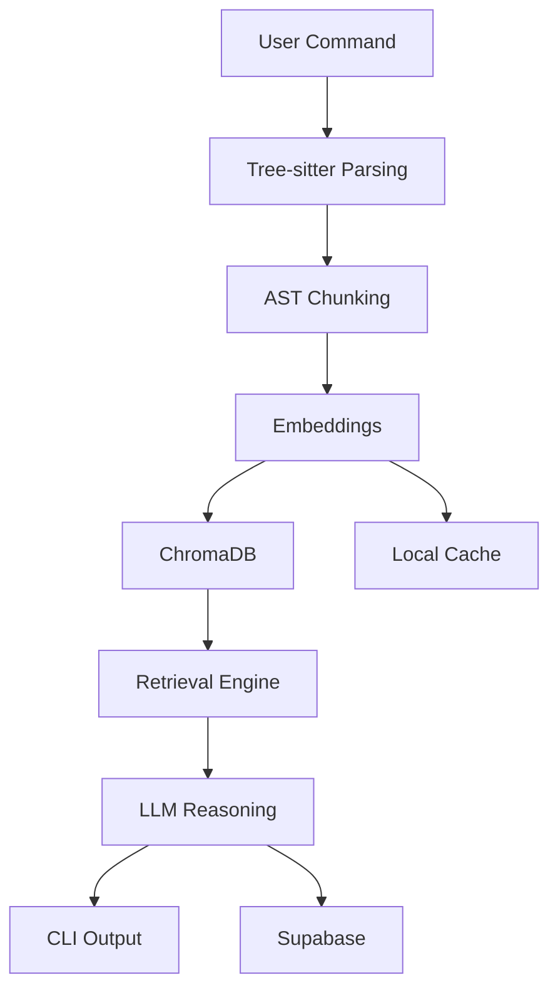

# 🔍 INsight-AI

### *Understand Codebases Like Systems — Not Files*

<p align="center">
  <b>AI-powered code intelligence directly in your terminal</b><br/>
  Analyze • Query • Visualize • Explain
</p>

<p align="center">
  
  
  
  
</p>

---

## ⚡ The Problem

Modern codebases are:

* Too large to read
* Too complex to trace
* Poorly documented

Developers waste hours answering:

* *“Where does this flow start?”*
* *“What depends on this module?”*
* *“How does this system actually work?”*

---

## 🚀 The Solution

**INsight-AI turns your codebase into a queryable system.**

Instead of reading files →
you **ask questions and get structured answers.**

---

## 🧠 What Makes It Different

| Traditional Tools  | INsight-AI                   |
| ------------------ | ---------------------------- |
| Text-based search  | AST-aware understanding      |
| File-level context | Function/Class-level context |
| Static docs        | Dynamic explanations         |
| No reasoning       | LLM-powered reasoning        |

---

## 🎯 Core Capabilities

* 🧠 **AST-Based Code Understanding** (Tree-sitter)
* 🔍 **Semantic Search (RAG Pipeline)**
* 💬 **Conversational Code Querying**
* 🏗 **Architecture Mapping**
* 📖 **12-Chapter Codebase Story Engine**
* 🌐 **Cloud + Local Hybrid Execution**

---

## ⚠️ Default Behavior

```bash
insight chat
```

➡️ Internally runs:

```bash
insight chat -p ollama -m qwen2.5-coder
```

No config needed. Works out of the box.

---

## ⚡ Quick Demo

```bash
# 1. Analyze codebase
insight analyze .

# 2. Start chat
insight chat

# 3. Ask anything
"Explain authentication flow"
"Where is state managed?"
"Give me architecture overview"
```
---

## 💬 Multi-Provider Support

<p align="center">
  
</p>

| Provider        | Command                     |
| --------------- | --------------------------- |
| OpenAI          | `insight chat -p openai`    |
| Groq            | `insight chat -p groq`      |
| Anthropic       | `insight chat -p anthropic` |
| Google          | `insight chat -p google`    |
| Local (default) | `insight chat`              |

---

## ⚙️ System Architecture



---

## 🧰 CLI Overview

```bash
insight analyze .
insight chat
insight learn
insight architecture
insight story
insight report
```

---

## 🏗 Real Workflows

### 🧑‍💻 New Codebase

```bash
insight analyze .
insight story
insight learn
```

### 🐛 Debugging

```bash
insight chat -p openai
```

### ⚡ Fast Queries

```bash
insight chat -p groq
```

### 🔒 Private Mode

```bash
insight analyze . --embedding ollama
insight chat -p ollama
```

---

## 📦 Tech Stack

| Layer      | Tech            |
| ---------- | --------------- |
| Parsing    | Tree-sitter     |
| Embeddings | OpenAI / Ollama |
| Vector DB  | ChromaDB        |
| Storage    | Supabase        |
| Interface  | CLI             |

---

## 📖 Signature Feature

```bash
insight story
```

Generates a **deep 12-chapter technical breakdown**:

* Architecture
* Data flow
* Dependencies
* Hidden logic
* Bottlenecks

---

## 📁 Project Structure

> Modular architecture separating **CLI interface**, **AI core engine**, and **RAG pipeline**
insight-ai/
├── python/ # 🧠 Core AI Engine (Python backend)
│ └── insight/
│ ├── api/ # LLM provider integrations (OpenAI, Anthropic, etc.)
│ ├── chains/ # LangChain pipelines (RAG + reasoning workflows)
│ ├── chunking/ # Tree-sitter based semantic code splitting
│ ├── ingestion/ # Codebase scanning & metadata extraction
│ ├── vectorstore/ # ChromaDB integration (embeddings + retrieval)
│ ├── database/ # Supabase & persistence layer
│ ├── cli/ # Python-side CLI execution layer
│ └── utils/ # Logging, helpers, shared utilities
│
├── src/ # 💻 Terminal UI Layer (TypeScript / React)
│ ├── components/ # Interactive terminal UI components
│ │ ├── Chat.tsx # Conversational interface
│ │ ├── Analyze.tsx # Analysis progress + results UI
│ │ └── CommandPalette.tsx # Command navigation system
│ ├── hooks/ # Custom hooks (state + terminal behavior)
│ ├── python-bridge.ts # Node ↔ Python communication layer
│ ├── theme.ts # Terminal styling and UI tokens
│ └── cli.tsx # CLI entry point (frontend layer)
│
├── scripts/ # ⚙️ Dev & automation scripts
│ ├── setup.cjs # Environment & dependency setup
│ └── test_providers.py # LLM provider connectivity tests
│
├── assets/ # 📦 Media assets
│ └── demo.gif # CLI demo preview
│
├── package.json # Node.js dependencies & config
└── README.md # Documentation

---

## 🧩 Roadmap

* [ ] VSCode Extension
* [ ] Visual Graph UI
* [ ] Multi-repo linking
* [ ] Team collaboration

---

## 🧑‍💻 Philosophy

> Code is a system of decisions.
> INsight helps you understand those decisions.

---

## ⭐ Support

If this helped you:

* Star ⭐ the repo
* Share with developers
* Contribute

---


