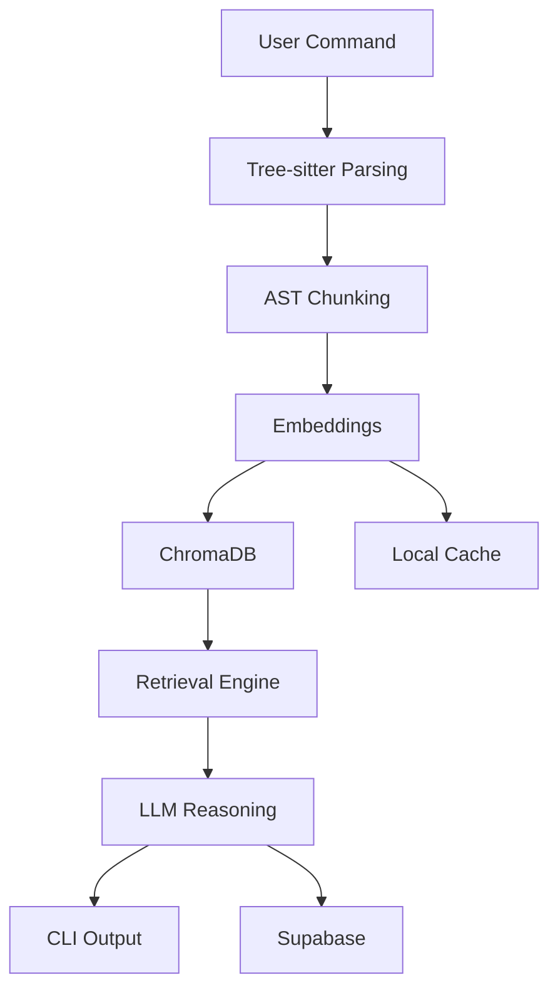

# 🔍 INsight-AI

### *Understand Codebases Like Systems — Not Files*

<p align="center">
  <b>AI-powered code intelligence directly in your terminal</b><br/>
  Analyze • Query • Visualize • Explain
</p>

<p align="center">
  
  
  
  
</p>

---

## ⚡ The Problem

Modern codebases are:

* Too large to read
* Too complex to trace
* Poorly documented

Developers waste hours answering:

* *“Where does this flow start?”*
* *“What depends on this module?”*
* *“How does this system actually work?”*

---

## 🚀 The Solution

**INsight-AI turns your codebase into a queryable system.**

Instead of reading files →
you **ask questions and get structured answers.**

---

## 🧠 What Makes It Different

| Traditional Tools  | INsight-AI                   |
| ------------------ | ---------------------------- |
| Text-based search  | AST-aware understanding      |
| File-level context | Function/Class-level context |
| Static docs        | Dynamic explanations         |
| No reasoning       | LLM-powered reasoning        |

---

## 🎯 Core Capabilities

* 🧠 **AST-Based Code Understanding** (Tree-sitter)
* 🔍 **Semantic Search (RAG Pipeline)**
* 💬 **Conversational Code Querying**
* 🏗 **Architecture Mapping**
* 📖 **12-Chapter Codebase Story Engine**
* 🌐 **Cloud + Local Hybrid Execution**

---

## ⚠️ Default Behavior

```bash
insight chat
```

➡️ Internally runs:

```bash
insight chat -p ollama -m qwen2.5-coder
```

No config needed. Works out of the box.

---

## ⚡ Quick Demo

```bash
# 1. Analyze codebase
insight analyze .

# 2. Start chat
insight chat

# 3. Ask anything
"Explain authentication flow"
"Where is state managed?"
"Give me architecture overview"
```
---

## 💬 Multi-Provider Support

<p align="center">
  
</p>

| Provider        | Command                     |
| --------------- | --------------------------- |
| OpenAI          | `insight chat -p openai`    |
| Groq            | `insight chat -p groq`      |
| Anthropic       | `insight chat -p anthropic` |
| Google          | `insight chat -p google`    |
| Local (default) | `insight chat`              |

---

## ⚙️ System Architecture



---

## 🧰 CLI Overview

```bash
insight analyze .
insight chat
insight learn
insight architecture
insight story
insight report
insight whoami
```

---

## 👤 User Identity & Management

INsight automatically identifies each user via a **machine fingerprint** — no login or registration required. Each user gets isolated data (vector stores, conversations, workspaces).

### 🚀 Getting Started (Important)

**Always run `analyze` first** — this indexes your codebase and automatically creates your user identity:

```bash
# Step 1: Analyze your project (required first step)
insight analyze .

# Step 2: Now you can chat, query, or explore
insight chat
```

> **Note:** Running `insight analyze .` is required before any other command. It scans your codebase, generates embeddings, and registers your identity. Without it, commands like `chat` or `whoami` won't have any data to work with.

### Check Your Identity

```bash
insight whoami
```

Shows:

```
╭────────────────── ✦ Your INsight Identity ──────────────────╮
│   👤 User:         piyushraj                                │
│   🔑 ID:           775d8f08                                 │
│   📅 Member Since: Apr 01, 2026                             │
│   ⏱️  Last Active:  just now                                 │
│   ☁️  Cloud Sync:   Connected ✓                              │
│   📦 Projects:     3 indexed                                │
╰─────────────────────────────────────────────────────────────╯
```

### Manage API Keys

```bash
# Save a key globally
insight config set-key openai sk-your-key-here
insight config set-key groq gsk_your-key-here

# List saved keys
insight config list

# Remove a key
insight config remove openai
```

Keys are stored locally in `~/.insight/config.json` and are never shared.

---

## 🏗 Real Workflows

### 🧑‍💻 New Codebase

```bash
insight analyze .
insight story
insight learn
```

### 🐛 Debugging

```bash
insight chat -p openai
```

### ⚡ Fast Queries

```bash
insight chat -p groq
```

### 🔒 Private Mode

```bash
insight analyze . --embedding ollama
insight chat -p ollama
```

---

## 📦 Tech Stack

| Layer      | Tech            |
| ---------- | --------------- |
| Parsing    | Tree-sitter     |
| Embeddings | OpenAI / Ollama |
| Vector DB  | ChromaDB        |
| Storage    | Supabase        |
| Interface  | CLI             |

---

## 📖 Signature Feature

```bash
insight story
```

Generates a **deep 12-chapter technical breakdown**:

* Architecture
* Data flow
* Dependencies
* Hidden logic
* Bottlenecks

---

## 📁 Project Structure

> Modular architecture separating CLI interface, AI core engine, and RAG pipeline

```bash
insight-ai/
├── python/
│   └── insight/                # Core AI & Logic Engine (Python)
│       ├── api/                # external LLM provider integrations (OpenAI, Anthropic, etc.)
│       ├── chains/             # LangChain implementation for RAG and analysis
│       ├── chunking/           # Tree-sitter powered semantic code splitting
│       ├── cli/                # Python-side CLI entry and argument parsing
│       ├── database/           # Supabase and persistence layer management
│       ├── ingestion/          # Codebase scanning and metadata extraction
│       ├── utils/              # Shared helper functions and logging
│       └── vectorstore/        # ChromaDB integration for semantic search
├── src/                        # Terminal UI & CLI Layer (TypeScript/React)
│   ├── components/             # UI components for the interactive terminal interface
│   │   ├── Chat.tsx            # Interactive AI chat interface component
│   │   ├── Analyze.tsx         # Code analysis progress and results UI
│   │   └── CommandPalette.tsx  # Interactive command selection menu
│   ├── hooks/                  # Custom React hooks for terminal state management
│   ├── python-bridge.ts        # Communication layer between Node.js and Python
│   ├── theme.ts                # Visual styling and color tokens for the TUI
│   └── cli.tsx                 # Main entry point for the TypeScript CLI
├── scripts/                    # Development and automation scripts
│   ├── setup.cjs               # Automated environment and dependency installer
│   └── test_providers.py       # LLM provider connectivity validation suite
├── assets/                     # Project media and documentation visual assets
│   └── demo.gif                # Animated demonstration of the CLI in action
├── package.json                # Node.js project configuration and dependencies
└── README.md                   # Project documentation and architectural overview

```
---

## 🧩 Roadmap

* [ ] VSCode Extension
* [ ] Visual Graph UI
* [ ] Multi-repo linking
* [ ] Team collaboration

---

## 🧑‍💻 Philosophy

> Code is a system of decisions.
> INsight helps you understand those decisions.

---

## ⭐ Support

If this helped you:

* Star ⭐ the repo
* Share with developers
* Contribute

---


